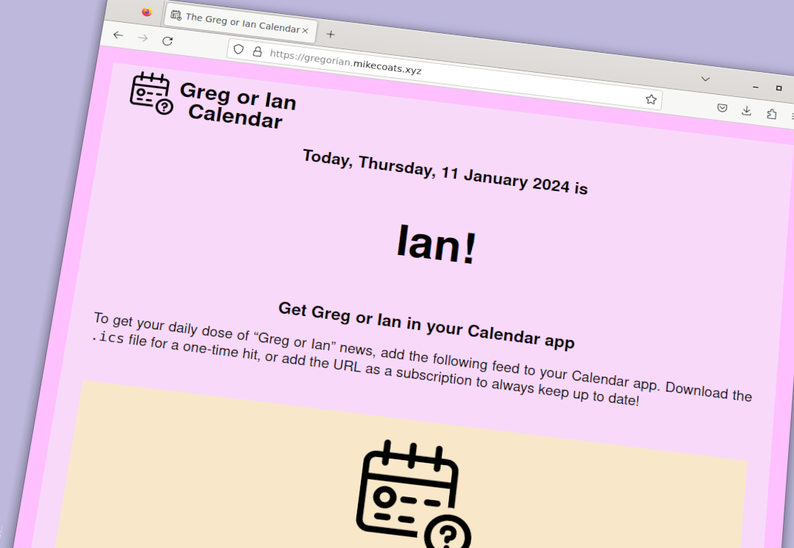
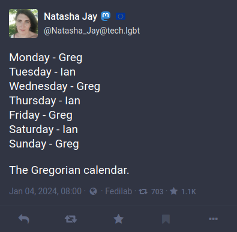

# The Greg or Ian Calendar

[gregorian.mikecoats.xyz](https://gregorian.mikecoats.xyz)

A web app with an integrated iCal feed so you will always know whether today is a Greg or Ian day!



## For developers

### Install the required packages

```sh
$ python -m venv .venv
$ source .venv/bin/activate
$ pip install -r dev-requirements.txt
```

### Debug with Visual Studio Code

Install Microsoft's
[Python extension](https://marketplace.visualstudio.com/items?itemName=ms-python.python),
if you haven't already. Then launch vscode from within the project's activated
virtualenv.

```sh
$ source .venv/bin/activate
$ code .
```

Add the following snippet to your `.vscode/launch.json`'s `.configuration`
array.

```json
{
    "name": "Debug Greg or Ian",
    "type": "python",
    "request": "launch",
    "module": "uvicorn",
    "args": [
        "main:app",
        "--reload",
        "--host", "0.0.0.0",
        "--port", "8001"
    ],
    "jinja": true,
    "justMyCode": true
}
```

### Linting the project

```sh
$ black main.py

$ isort main.py

$ flake8 main.py

$ pylint main.py
```

### Deploy the project

```sh
$ ansible-playbook -i inventory.yaml gregorian.playbook.yaml
```

## Credits

### Inspiration
[The Gregorian calendar](https://tech.lgbt/@Natasha_Jay/111696622594397672)
by 
[Natasha Jay](https://tech.lgbt/@Natasha_Jay)
.



### Icon

[Help calendar](https://thenounproject.com/icon/help-calendar-656853/)
by
[Khomsun Chaiwong](https://thenounproject.com/mooyai/)
made available under
[CC BY 3.0](https://creativecommons.org/licenses/by/3.0/)
.


